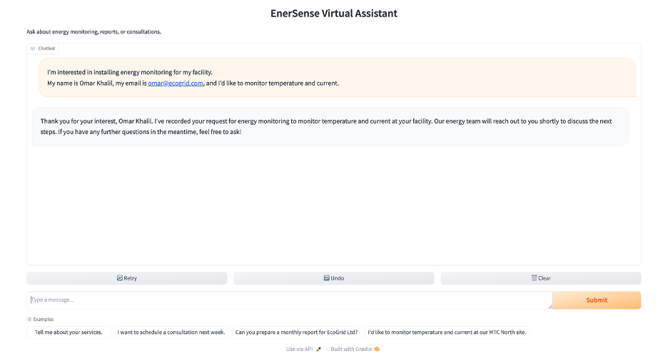
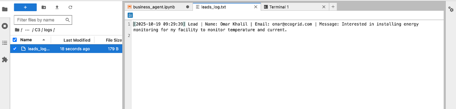
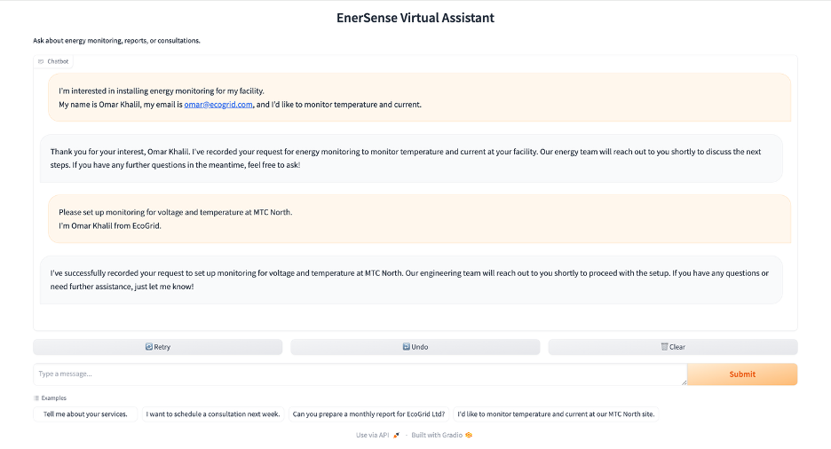
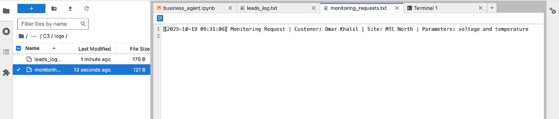
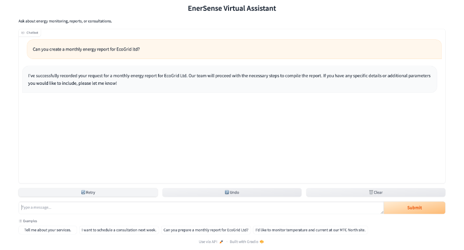
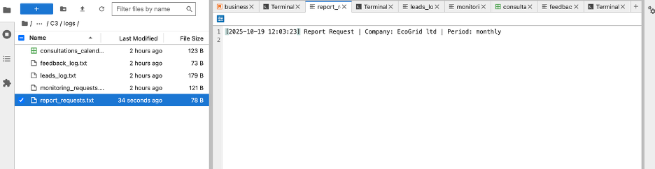

# EnerSense Business Agent 🤖⚡️

EnerSense is a **smart virtual assistant** for a fictitious energy consultancy — **EnerSense Analytics** — that helps clients inquire about services, schedule consultations, and request automated energy reports.  
It uses **OpenAI GPT-4o-mini** for reasoning and runs through a **Gradio chatbot interface**.

---

## 📘 Features

- Answers questions about EnerSense Analytics (mission, founders, and services)
- Collects customer leads (name, email, and message)
- Records site monitoring and energy report requests
- Schedules consultations with automatic conflict detection
- Lists available consultation slots for any date
- Logs all interactions and tool actions inside the `/logs/` directory

---

## ⚙️ Setup Instructions

### Step 1 — Create a Virtual Environment (optional)
```bash
python3 -m venv venv
source venv/bin/activate
```

### Step 2 — Install Dependencies
```bash
pip install -r requirements.txt
```

### Step 3 — Create a `.env` File
Create a new file named `.env` in the project directory and add your OpenAI API key:
```
OPENAI_API_KEY=sk-your-openai-key-here
```

### Step 4 — Run the Application
If you’re using **Jupyter** or **Colab**, open and run:
```
business_agent.ipynb
```

Or if you’re using a **local Python environment** with **Gradio**:
```bash
python app.py
```

---

## 🧠 Tools Overview

| Function | Description | Log File |
|---|---|---|
| `record_customer_interest()` | Saves customer leads | `logs/leads_log.txt` |
| `record_feedback()` | Logs unanswered or off-topic questions | `logs/feedback_log.txt` |
| `log_site_monitoring_request()` | Records site monitoring setup requests | `logs/monitoring_requests.txt` |
| `log_energy_report_request()` | Logs energy report generation requests | `logs/report_requests.txt` |
| `schedule_consultation()` | Books consultations and prevents conflicts | `logs/consultations_calendar.csv` |
| `list_available_slots()` | Lists open consultation times | `logs/consultations_calendar.csv` |

---

## 💬 Example Test Cases

Below are sample test conversations and their expected behaviors.

---

### Test 1 — Lead Collection
**User:**  
I’m interested in installing energy monitoring for my facility.  
My name is Omar Khalil, my email is omar@ecogrid.com, and I’d like to monitor temperature and current.

**Expected Tool:** `record_customer_interest`  
**Expected Log:** `logs/leads_log.txt`  
**Expected Reply (in brief):**  
Thank you Omar Khalil. Your interest in energy monitoring has been recorded. Our energy team will reach out soon.

  


---

### Test 2 — Monitoring Setup
**User:**  
Please set up monitoring for voltage and temperature at MTC North.  
I’m Omar Khalil from EcoGrid.

**Expected Tool:** `log_site_monitoring_request`  
**Expected Log:** `logs/monitoring_requests.txt`  
**Expected Reply (in brief):**  
Monitoring request for MTC North by Omar Khalil has been recorded. Our engineers will contact you soon.

  


---

### Test 3 — Consultation Booking
**User:**  
I’d like to schedule a consultation on October 22 at 11:00 about energy optimization.  
My name is Sarah Nader.

**Expected Tool:** `schedule_consultation`  
**Expected Log:** `logs/consultations_calendar.csv`  
**Expected Reply (in brief):**  
Consultation booked for Sarah Nader on 2025-10-22 11:00 about 'energy optimization'. Our team will confirm shortly.

  


---

### Test 4 — Conflict Handling
**User:**  
I’d like to schedule a consultation on October 22 at 11:00 about solar setup.  
My name is Hadi Nader.

**Expected Tool:** `schedule_consultation`  
**Expected Reply (in brief):**  
That time slot on 2025-10-22 is already reserved. Please choose another time that day.  
**Expected Log:** No new record added.


---

### Test 5 — Check Available Time Slots
**User:**  
What are the available time slots on October 22nd, 2025?

**Expected Tool:** `list_available_slots(date="2025-10-22")`  
**Expected Log:** *(read-only; no new file written)*  
**Expected Reply (examples):**  
- If empty day: `Available consultation slots on 2025-10-22: 09:00, 10:00, 11:00, 12:00, 13:00, 14:00, 15:00, 16:00.`  
- If 11:00 is booked: `Available consultation slots on 2025-10-22: 09:00, 10:00, 12:00, 13:00, 14:00, 15:00, 16:00.`


---

### Test 6 — Feedback or Off-Topic
**User:**  
What’s your favorite color?

**Expected Tool:** `record_feedback`  
**Expected Log:** `logs/feedback_log.txt`

  


---

### Test 7 — General Question About the Company
**User:**  
What is IntelliSense?

**Expected Tool:** `record_feedback(question="What is IntelliSense?")`  
**Expected Log:** `logs/feedback_log.txt`


---

### Test 8 — Energy Report Request
**User:**  
Can you prepare a **monthly energy report** for **EcoGrid Ltd**?

**Expected Tool:** `log_energy_report_request(company_name="EcoGrid Ltd", period="monthly")`  
**Expected Log:** `logs/report_requests.txt`  
**Expected Reply (in brief):**  
Energy report request for EcoGrid Ltd (monthly) recorded successfully. Our analytics team will compile and deliver your report shortly.

  


---

## 🧾 Logs Directory

After completing the tests, your `/logs` folder should contain:

```
logs/
├── consultations_calendar.csv
├── feedback_log.txt
├── leads_log.txt
├── monitoring_requests.txt
└── report_requests.txt
```

---

### Prepared by  
**Hadi Al Mubasher**  
*hma154@mail.aub.edu*
